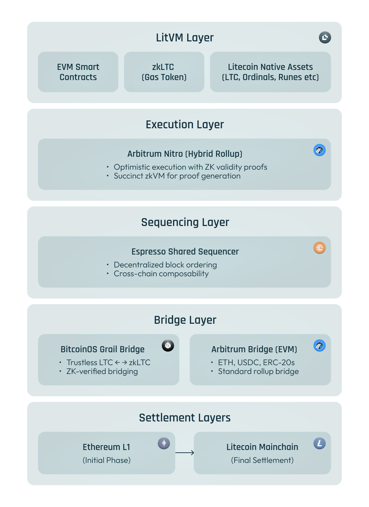

# Architecture

LitVM is built on a modular, multi-layer architecture that combines the best of Arbitrum's battle-tested rollup technology with BitcoinOS's trustless bridging infrastructure. This design enables LitVM to deliver EVM compatibility, ZK security, and trustless Litecoin integration without requiring any changes to Litecoin's base protocol.

## Architecture Overview

<figure><figcaption></figcaption></figure>

### Core Components



### Arbitrum Orbit Rollup

LitVM is built as an **Arbitrum Orbit chain** using the Nitro tech stack. Arbitrum Orbit enables permissionless deployment of customizable chains with:

* **EVM Equivalence** : Full compatibility with Ethereum smart contracts, tooling, and developer experience
* **Fraud Proofs** : Interactive fraud proof mechanism for transaction validity
* **Advanced Compression** : Efficient data batching for lower costs
* **Custom Gas Token** : zkLTC as the native gas token instead of ETH

Why Arbitrum Orbit?

* Battle-tested technology powering billions in TVL
* Active ecosystem of developers and tooling
* Continuous upgrades from Offchain Labs
* Flexibility to customize gas tokens, governance, and more



### Succinct zkVM Integration

LitVM enhances the Arbitrum Nitro rollup with **Succinct's SP1 zkVM** to generate validity proofs for all chain execution, creating a **hybrid rollup** architecture:

* **SP1 zkVM** : General-purpose zero-knowledge virtual machine that can prove execution of any Rust program
* **Validity Proofs** : Cryptographic proofs that verify correct state transitions
* **Fast Finality** : Proofs can be verified in minutes rather than the 7-day challenge period of pure optimistic rollups
* **Cost Efficiency** : Proof costs as low as $0.01-0.02 per transaction

This hybrid approach combines:

* The immediate execution speed of optimistic rollups
* The cryptographic security guarantees of ZK rollups



### Espresso Shared Sequencer

LitVM utilizes **Espresso's shared sequencer** for decentralized block ordering:

* **Decentralized Sequencing** : Block proposals distributed across a permissionless node network
* **Censorship Resistance** : No single entity controls transaction ordering
* **Cross-Chain Composability** : Shared sequencing enables atomic operations across chains
* **Network Security** : Multiple independent sequencers provide redundancy



### Dual Bridge Architecture

LitVM features two bridging systems to connect both the Litecoin and Ethereum ecosystems.

#### BitcoinOS Grail Bridge (Litecoin ↔ LitVM)

The **Grail Bridge** enables trustless LTC movement between Litecoin mainchain and LitVM:

How It Works:

1. **Deposit** : User locks LTC in a Taproot address on Litecoin mainchain
2. **Proof Generation** : BitcoinOS generates a ZK-SNARK proof verifying the locked funds
3. **Minting** : zkLTC is minted on LitVM at 1:1 ratio
4. **Withdrawal** : User burns zkLTC on LitVM, proof is verified, LTC is released on mainchain

Security Model:

* **Non-Custodial** : No third party ever holds user funds
* **1/n Security** : Only one honest validator needed for security
* **ZK Verification** : Proofs are mathematically verifiable—like solving a math problem with a definitive answer
* **No Protocol Changes** : Works with existing Litecoin infrastructure

#### Arbitrum Bridge (Ethereum ↔ LitVM)

As an Arbitrum Orbit chain, LitVM also supports the standard **Arbitrum Bridge** for EVM-native assets:

Supported Assets:

* ETH
* USDC, USDT, and other stablecoins
* ERC-20 tokens
* Other Ethereum-native assets

How It Works:

1. **Deposit** : User deposits assets on Ethereum (or Arbitrum One) via the bridge contract
2. **Confirmation** : After sufficient confirmations, assets are credited on LitVM
3. **Withdrawal** : User initiates withdrawal on LitVM, assets are released after challenge period (or faster with validity proofs)

Benefits:

* Access to Ethereum's deep liquidity
* Familiar bridging experience for EVM users
* Standard security model inherited from Arbitrum
* Gateway for DeFi protocols and stablecoins

#### Bridge Comparison

| **Feature**      | **BitcoinOS Grail**    | **Arbitrum Bridge**    |
| ---------------- | ---------------------- | ---------------------- |
| **Source Chain** | Litecoin               | Ethereum / EVM         |
| **Asset Type**   | LTC → zkLTC            | ETH, ERC-20s           |
| **Trust Model**  | ZK proofs (1/n)        | Optimistic + ZK hybrid |
| **Custodian**    | None (non-custodial)   | Bridge contracts       |
| **Primary Use**  | Onboard Litecoin users | Onboard Ethereum users |



## Mainnet Rollout Phases

LitVM's mainnet will be deployed in three phases:



### Phase: Ethereum Settlement + Dual Bridges

* Fully operational Arbitrum Orbit rollup settling on Ethereum
* Nitro's optimistic architecture with Succinct zkVM validity proofs
* **BitcoinOS Grail bridge** deployed for trustless LTC bridging
* **Arbitrum Bridge** available for ETH and ERC-20 assets
* Espresso shared sequencer for decentralized block ordering
* zkLTC as gas token and primary base asset



### Phase: Litecoin Proof Anchoring

* All finalized chain batches anchored to Litecoin blockchain
* Validity proofs inscribed using standard extended transactions
* No Litecoin protocol changes required
* Creates tamper-resistant audit trail secured by Litecoin's PoW
* Independent verification possible via Litecoin nodes



### Phase: Litecoin Native Settlement

* Migration of settlement from Ethereum to Litecoin
* LitVM becomes a fully native Litecoin rollup
* Litecoin as the canonical settlement and finality layer
* Complete sovereignty under Litecoin's 14+ years of PoW security



## Technical Specifications

| **Component**    | **Technology**      | **Purpose**                             |
| ---------------- | ------------------- | --------------------------------------- |
| **Execution**    | Arbitrum Nitro      | EVM-compatible smart contract execution |
| **Proving**      | Succinct SP1 zkVM   | Generate validity proofs                |
| **Sequencing**   | Espresso            | Decentralized transaction ordering      |
| **LTC Bridging** | BitcoinOS Grail     | Trustless LTC ↔ zkLTC transfers         |
| **EVM Bridging** | Arbitrum Bridge     | ETH, stablecoins, ERC-20 transfers      |
| **Gas Token**    | zkLTC               | Native transaction fee token            |
| **Settlement**   | Ethereum → Litecoin | State finality and security             |

## Network Parameters (Testnet)

| **Parameter**       | **Value**                                                  |
| ------------------- | ---------------------------------------------------------- |
| **Network Name**    | LitVM Testnet                                              |
| **Chain ID**        | ⚠️ **TBA** — This value will be published closer to launch |
| **Native Currency** | zkLTC                                                      |
| **Block Time**      | Variable (on-demand)                                       |
| **Gas Limit**       | 32,000,000 (effective)                                     |
| **EVM Version**     | Shanghai                                                   |

Note: Final parameters will be confirmed at testnet launch.

## Security Considerations

LitVM inherits security from multiple layers:

1. **Litecoin Mainchain** : 14+ years of uninterrupted PoW security
2. **Ethereum Settlement** (Phase 1): World's most decentralized smart contract platform
3. **ZK Proofs** : Mathematical guarantees of execution correctness
4. **Espresso Sequencing** : Decentralized block production prevents censorship
5. **BitcoinOS Grail** : Non-custodial bridging with 1/n security
6. **Arbitrum Bridge** : Battle-tested rollup bridge infrastructure
