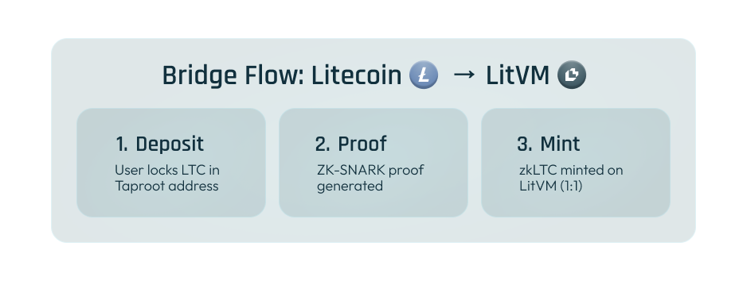
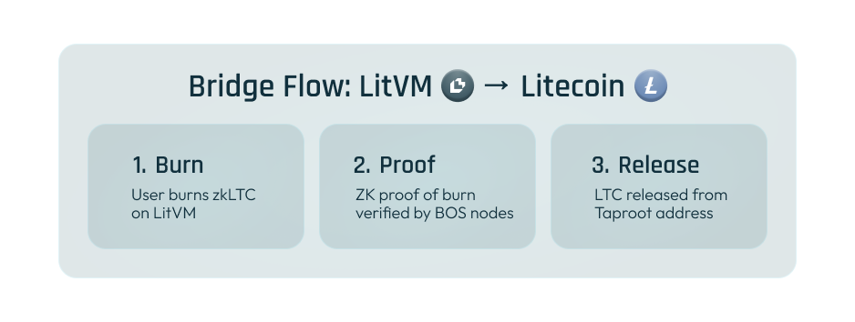

# BitcoinOS Technology

LitVM's trustless bridging capability is powered by **BitcoinOS (BOS)**—an operating system that extends UTXO blockchain capabilities beyond simple payments into programmable, decentralized applications. BitcoinOS enables LitVM to bridge native Litecoin assets without trusted intermediaries, custodians, or multisig schemes.

## What is BitcoinOS?

BitcoinOS is an ecosystem that combines zero-knowledge proofs (ZKP), multiparty computation (MPC), and advanced cryptography to create a framework for smart contracts, synthetic assets, and cross-chain interoperability—all without compromising the security model of UTXO-based blockchains.

Originally developed for Bitcoin, BitcoinOS is being adapted for Litecoin to leverage its faster 2.5-minute block times and Scrypt-based consensus, optimizing for rapid finality and low-cost settlement.

### Historic Achievement

In July 2024, BitcoinOS became the **first to verify a ZK proof on Bitcoin's mainnet** (block 853626) without requiring a hard fork. This breakthrough demonstrated that trustless, ZK-verified operations are possible on UTXO chains using existing infrastructure.

## Core Components



### BitSNARK Verification

**BitSNARK** is the ZK verification protocol at the core of BitcoinOS. It enables verification of zero-knowledge proofs directly on UTXO blockchains.

**Key Features:**

* **Small Proof Size** : Fixed proof size of just \~300 bytes
* **Efficient Verification** : Up to 40 bridge transactions per block
* **No Protocol Changes** : Works within existing Litecoin script constraints
* **Fraud-Proof Security** : Deterministic fraud proofs executed in script

**How It Works:**

The verification process is optimistic—uncontested proofs are accepted—but incorporates fraud-proof mechanisms that can be executed in Bitcoin/Litecoin Script without requiring opcode changes. This ensures:

* **1/n Security** : A single honest verifier can maintain system integrity
* **Deterministic Challenges** : Any invalid proof attempt exposes dishonesty
* **Infeasible Attacks** : Compromising the network requires controlling all nodes



### Grail Bridge

**Grail** is a multichain vault that enables trustless asset transfers between Litecoin and LitVM (and other chains). It's the "holy grail" technology for unleashing UTXO blockchain potential.

#### Bridge Flow: Litecoin → LitVM

<figure><figcaption></figcaption></figure>

#### Bridge Flow: LitVM → Litecoin

<figure><figcaption></figcaption></figure>

**Security Properties**

| **Property**      | **Description**                                         |
| ----------------- | ------------------------------------------------------- |
| **Non-Custodial** | LTC is never held by a third party                      |
| **Trustless**     | No reliance on honest majority—math provides guarantees |
| **Verifiable**    | Anyone can verify bridge transactions on-chain          |
| **1:1 Backing**   | Every zkLTC is backed by locked LTC on mainchain        |
| **Fraud-Proof**   | Invalid operations can be challenged and penalized      |

**ZK-SNARK Proof Contents**

The ZK proof verifies:

* ✓ Correct PegIn address
* ✓ Deposited amount matches
* ✓ Valid block header
* ✓ Transaction in Merkle tree
* ✓ Sufficient confirmations
* ✓ Bitcoin/Litecoin blockchain inclusion



### BOS Node Network

BitcoinOS operates via a **cluster of permissionless nodes** that:

* Execute BOS computations
* Verify ZK proofs
* Monitor bridge operations
* Maintain system integrity

**Security Guarantees:**

* Permissionless participation—anyone can run a node
* Only one honest node needed for security (1/n security)
* Fraud proofs are deterministic and publicly verifiable



## Grail vs. Traditional Bridges

Traditional crypto bridges have been responsible for billions in losses due to their reliance on trusted intermediaries:

| **Aspect**         | **Traditional Bridges**           | **Grail Bridge**              |
| ------------------ | --------------------------------- | ----------------------------- |
| **Trust Model**    | Multisig (m-of-n honest majority) | ZK proofs (1 honest verifier) |
| **Custody**        | Third-party custodians            | Non-custodial (user controls) |
| **Verification**   | Off-chain consensus               | On-chain mathematical proof   |
| **Attack Surface** | Compromise m+1 keys               | Compromise ALL nodes          |
| **Audit Trail**    | Limited visibility                | Fully on-chain verifiable     |

### Why ZK Bridges Are Different

ZK-proof verification is like solving a math problem—there's a definitive, verifiable answer. Unlike consensus-based systems where security depends on honest behavior, ZK bridges provide mathematical guarantees:

> "Even a single honest node ensures the bridge's integrity, making it more secure than designs dependent on majority consensus."
>
> — BitcoinOS Team

## Litecoin-Specific Optimizations

BitcoinOS's adaptation for Litecoin includes several optimizations:

### Faster Block Times

* **Litecoin** : 2.5-minute blocks (4x faster than Bitcoin)
* **Benefit** : Faster deposit confirmations and bridge finality

### Scrypt Consensus

* **Litecoin** : Scrypt-based proof-of-work
* **Benefit** : Broad, decentralized mining ecosystem

### MWEB Integration (Planned)

* **Litecoin** : MimbleWimble Extension Blocks for privacy
* **Benefit** : Optional privacy features for zkLTC transactions

## Supported Asset Types

BitcoinOS enables bridging of various Litecoin-native assets:

| **Asset Type** | **Description**         | **Status**  |
| -------------- | ----------------------- | ----------- |
| **LTC**        | Native Litecoin         | ✅ Supported |
| **Ordinals**   | NFT-like inscriptions   | 🔜 Planned  |
| **Runes**      | Fungible token protocol | 🔜 Planned  |
| **LTC-20**     | Token standard          | 🔜 Planned  |
| **Charms**     | BitcoinOS native tokens | 🔜 Planned  |

## Future Capabilities

### MerkleMesh (Rollups to Litecoin)

BitcoinOS is developing **MerkleMesh**—technology for rolling up data into SNARK proofs validated on the Litecoin mainnet. This will enable:

* Full rollup settlement directly on Litecoin
* External blockchain rollups using Litecoin for security
* Enhanced interoperability and scalability

### Programmable Token Framework

BOS enables tokens inscribed with ZK proofs that embed smart contract logic directly on Litecoin:

* Customizable staking mechanics
* Automated governance
* Programmable issuance rules
* Cross-chain token operations

## Technical Resources

### BitcoinOS Documentation

* **Technical Docs**: [https://docs.bitcoinos.build/](https://docs.bitcoinos.build/)
* **Grail Bridge**: [https://docs.bitcoinos.build/technical-documentation/grail](https://docs.bitcoinos.build/technical-documentation/grail)
* **BitSNARK**: [https://docs.bitcoinos.build/technical-documentation/quickstart/bitsnark-vm-verifying-zksnarks-on-bitcoin](https://docs.bitcoinos.build/technical-documentation/quickstart/bitsnark-vm-verifying-zksnarks-on-bitcoin)

### Testnet Bridge

* **Grail Testnet**: [https://test-grail.bitcoinos.build/](https://test-grail.bitcoinos.build/)
* **Supported Testnets** : Ethereum Holešky, Base Sepolia, Mode Sepolia, and more

## Summary

BitcoinOS technology enables LitVM to offer what has never before been possible:

* ✅ Truly trustless bridging without custodians
* ✅ Mathematically verifiable security via ZK proofs
* ✅ Non-custodial asset transfers
* ✅ No protocol changes required on Litecoin
* ✅ 1/n security—only one honest node needed

This infrastructure positions LitVM as the first true Litecoin ZK rollup in the UTXO ecosystem, bringing the security and decentralization principles of Litecoin to the programmable blockchain era.
